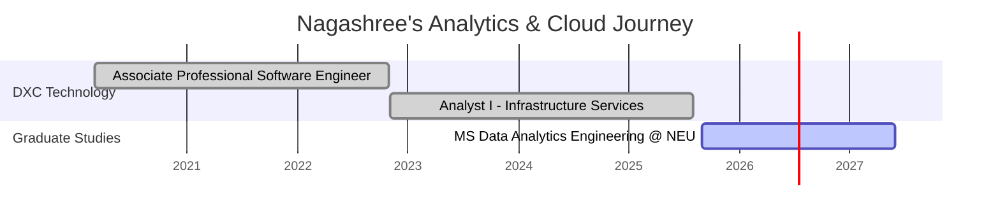

<!-- ⚡ NAGASHREE – DATA & CLOUD ANALYTICS README ⚡ -->

<h1 align="center">
  
</h1>

<p align="center">
  <a href="mailto:bommenahallikumara.n@northeastern.edu">
    
  </a>
  <a href="https://www.linkedin.com/in/nagashreebk">
    
  </a>
  
</p>

---

## ⚡ About Me

- 🎓 **Master’s in Data Analytics Engineering**, Northeastern University (Boston) — *Expected 2027*  
- 🎓 **B.E. in Telecommunication Engineering**, Dayananda Sagar College of Engineering (CGPA: 9.0/10)  
- 📊 5+ years of experience at **DXC Technology** in **Infrastructure Analytics, Monitoring, and Automation**  
- ☁️ Hands-on with **AWS (S3, Lambda, EC2, SageMaker)** and **Azure (ADF, Databricks, Data Lake)**  
- 📈 Love turning raw logs & events into **insightful dashboards** using **Power BI, SQL & Python**  
- 🔍 Strong in **ETL, KPI design, SLA monitoring, incident analytics, and automation**  
- 🎯 Goal: Grow into a **Data / Analytics Engineer** role working on scalable cloud data platforms & BI  

---

## 🧠 Tech Universe

<p align="center">
  <br/>
  
</p>

### 🛠 Core Skills

- **Programming:** Python (Pandas, NumPy, Matplotlib, Seaborn), SQL, Java  
- **Databases:** SQL Server, MySQL, Oracle, Snowflake  
- **BI & Visualization:** Power BI, Tableau, Excel (Advanced), Tableau Prep, Power Automate  
- **Cloud & Data:** AWS (S3, EC2, Lambda, SageMaker), Azure (Data Factory, Databricks, Data Lake)  
- **Monitoring & Ops:** Linux/Unix Admin, Windows Server, Splunk, Syslog, Server Health Monitoring  
- **Certifications:** AZ-900, AWS Cloud Practitioner, Six Sigma Yellow Belt, Java, SQL  

---

## 🌈 Skill Spectrum (Analytics “Pivot” View)

```diff
Data Analytics & BI         ██████████████░░ 90%
Cloud Data (AWS + Azure)    ███████████░░░░ 80%
ETL & Pipelines             ███████████░░░░ 80%
SQL & Databases             ████████████░░░ 85%
Infra Monitoring & Logs     ███████████████ 95%
Automation & Scripting      ███████████░░░░ 80%
```

---

## 💼 Experience Snapshot

### 🟣 Analyst I – Infrastructure Services · DXC Technology  
**Nov 2022 – Jul 2025 · Bangalore, India**

- Built **Power BI dashboards** from ServiceNow + Azure SQL, improving **SLA visibility and decision-making**  
- Designed **ETL workflows** using Python, SQL, and Azure Data Factory to transform logs into analytics datasets  
- Reduced manual reporting time using automated pipelines and optimized SQL queries  
- Integrated **AWS (S3, Lambda)** and **Azure (ADF, Data Lake)** to automate dashboard refreshes  
- Applied **Six Sigma** principles to reduce false alerts and improve incident resolution time  
- Created advanced **DAX measures & visuals** for real-time SLA breach tracking and trend analysis  

---

### 🔵 Associate Professional Software Engineer · DXC Technology  
**Mar 2020 – Oct 2022 · Bangalore, India**

- Automated OS, disk, CPU monitoring across **Linux, Windows & Azure** using Python + shell scripts  
- Centralized system logs from **VMware, AWS, Azure** for better visibility and reduced downtime  
- Built ETL flows using Python + SQL for multi-source integration and dashboard-ready datasets  
- Developed **Power BI & Excel dashboards** for system performance and SLA metrics  
- Used **Azure Monitor & Splunk** for proactive alerting and availability improvements  
- Applied **predictive analytics** on cloud logs to forecast potential incidents  

---

## 📊 GitHub Analytics (Dynamic)

<p align="center">
  
  
</p>

<p align="center">
  
</p>

---

## 🧩 Featured Work Areas

> You can later replace these with real GitHub project links.

| Area | Example Focus | Tech |
|------|---------------|------|
| 🔁 **ETL & Data Pipelines** | Automating ingestion from ServiceNow, AWS & Azure into analytics datasets | Python · SQL · ADF · Lambda |
| 📊 **SLA & Incident Dashboards** | Power BI dashboards for SLA tracking, trends, and outage impact | Power BI · DAX · Azure SQL |
| 🔥 **Infra Monitoring & Alerts** | Proactive alerting from logs & metrics, reducing false positives | Splunk · Azure Monitor · Shell · Python |

---

## 🧭 Journey Timeline (Mermaid)



---

## 🌍 Visitor Map

<p align="center">
  
</p>

---

## 🌌 Quote I Work By

<p align="center">
  
</p>

---

## 💬 Let’s Connect

<p align="center">
  <a href="mailto:bommenahallikumara.n@northeastern.edu">
    
  </a>
  <a href="https://www.linkedin.com/in/nagashreebk">
    
  </a>
  <a href="https://github.com/nagashreebk">
    
  </a>
</p>

---

<h3 align="center">⭐ Thanks for visiting! Always happy to talk data, cloud, and analytics dashboards.</h3>
